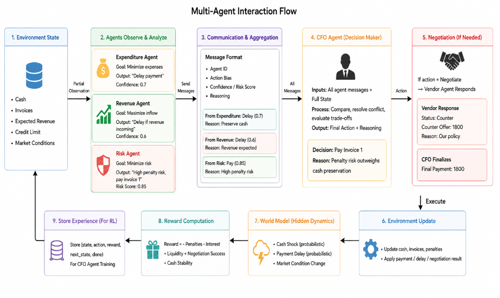
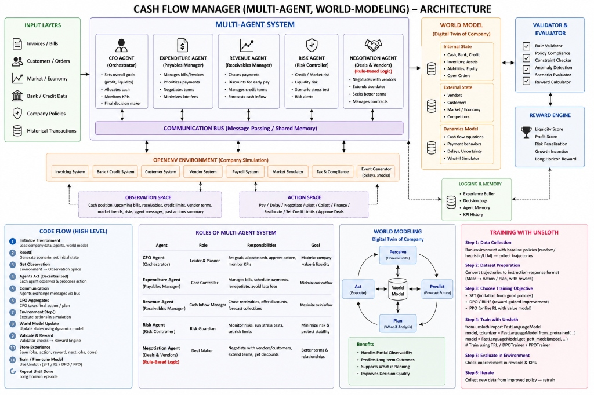

# CashFlow Arena: A Multi-Agent World Model for Enterprise Finance

*How we taught an AI to manage liquidity, negotiate with vendors, and avoid the bankruptcy trap.*

---

## The timing gap

Business failure is often not a failure of product, but a failure of timing. From the collapse of retail giant Big Bazaar under debt pressure to the rapid burn of high-growth startups like Housing.com, the pattern is clear: companies fail when the timing gap between bills and receivables is managed poorly. Even companies like Jet Airways can mask a hollow cash-core with paper wealth until bankruptcy is inevitable.

CashFlow Arena addresses this gap by training a CFO-agent that manages liquidity as a dynamic, interactive decision-making task rather than a static reporting exercise.

---

## What we built

CashFlow Arena is a simulation in which an AI agent plays the CFO of a company across a sequence of business days. Each day, the CFO sees its current cash position, a stack of unpaid invoices, expected customer payments, available credit, and short memos from three specialist advisors. It must then decide — for each invoice — whether to pay in full, defer, partially settle, draw on credit, or negotiate.

Underpaying triggers compounding late fees. Overpaying drains the cash buffer needed to absorb shocks. The interesting part is that none of this is read from a spreadsheet. The CFO interacts with a *living* world model that generates events, applies them, ages obligations, and rolls the dice on whether customers actually pay on time.

---

## The simulation environment

The environment follows the standard `reset / step / state` interface used in reinforcement learning, exposed via OpenEnv so any RL loop or remote client can drive it:

- **`reset(seed, difficulty, sim_window)`** initializes a fresh scenario — starting cash, credit limit, an initial invoice stack, expected receivables, and a hidden timeline of world events.
- **`step(action)`** applies one CFO decision (`pay`, `defer`, `partial`, `credit`, or `negotiate`) on a target invoice and returns the new observation.
- **`state`** returns the session metadata (episode id, step count) so any wrapper can track trajectories cleanly.

The state the CFO actually reasons over has these components:

- **Invoices** — vendor bills with amount, due date, late fee, and interest rate. Each day they age; once past due they incur fees and start compounding daily.
- **Receivables** — expected customer payments with an arrival day and a probability of actually showing up.
- **Credit** — a fixed credit line. The CFO can draw on it, but heavy use tanks the final score.
- **Vendor Profiles** — trust scores and negotiation flexibility, used by `negotiate` actions.
- **Advisor Memos** — structured notes from the three advisor agents.
- **World Events** — hidden, probabilistic shocks: equipment failure, tax audits, supplier price hikes, payment delays, fraud anomalies. The CFO doesn't see them in advance — only the Risk agent gets vague hints about market stress and upcoming threat level.

### Three difficulty modes

Every scenario is generated *dynamically* — no fixed test set, every run is a new game.

- **Easy** — comfortable cash buffer (₹40k–₹50k), low interest, reliable receivables, generous deadlines.
- **Medium** — balanced pressure (₹25k–₹35k cash), moderate interest, mixed reliability.
- **Hard** — tight runway (₹2k–₹5k cash), short deadlines, high interest, unreliable receivables.

The generator runs a solvability check on every scenario to guarantee the agent isn't being thrown an impossible board. Hard mode is calibrated to be solvable but only with near-perfect timing — there's no slack to hide bad decisions.

---

## The multi-agent flow

Rather than asking one giant model to do everything, the CFO problem is split across four specialists:

- **Expenditure Agent** — reads the unpaid invoice stack and recommends a payment priority.
- **Revenue Agent** — projects expected inflows weighted by probability.
- **Risk Agent** — assesses debt-to-cash ratio, credit utilization, and threat hints from the world model.
- **CFO Agent** — reads all three memos, sees the full state and history, and produces the final action plan.

Each agent has its own system prompt with a structured JSON output schema. The three advisor outputs are inserted verbatim into the CFO's prompt as `ADVISOR MEMOS`. This compositional design lets us evolve each role independently, and gives us four distinct LLM calls to log, debug, and optimize.

---

## Two paths to a competent CFO

We pursued two complementary approaches:

### Approach 1 — SFT + RL

Train smaller models on demonstration data, then refine with reinforcement learning against the simulation's reward rubric. We collected expert trajectories using a rule-based "ideal CFO," fine-tuned via SFT, and ran RL on top to push beyond imitation.

**Pros:** cheap inference per call, no per-day API cost, the model develops policy intuitions you can deploy offline.
**Cons:** heavy training infrastructure, longer iteration cycles, and the SFT ceiling is bounded by how good the rule-based teacher is.

### Approach 2 — In-Context Learning (ICL)

Use a frontier-class model directly with carefully engineered prompts containing structured examples. No training, no GPUs, just clean prompt design and Groq's hosted `llama-3.1-8b-instant`.

**Pros:** zero training time, fast iteration, every reasoning step is plain text you can read.
**Cons:** per-call latency, per-call cost, and rate-limit ceilings cap throughput hard.

---

## The optimization story

### Cutting the LLM calls that didn't need to happen

A surprising number of days don't need a multi-agent reasoning chain at all. If there are no overdue invoices, fewer than three unpaid bills, and enough cash to cover everything, the answer is trivial: pay what's due soon, defer the rest. We added a **rule-based fast path** that skips all four LLM calls on those days. On easy and medium difficulty, this drops total LLM calls per simulation by 30–50%.

For the days that do need agents, we trimmed prompts aggressively. The advisor prompts originally asked the model to write a long `thought_process` field "first" — a chain-of-thought trick. The problem: the model would burn through its 256-token output budget writing CoT, then truncate the JSON, causing `json_validate_failed` errors. Dropping `thought_process` from the advisor schemas (it wasn't read downstream anyway) shrunk per-call prompts by ~55% and eliminated the truncation failures entirely.

### Parallelizing the advisors

The three advisors don't depend on each other. Running them sequentially with safety sleeps between calls was wasting ~6 seconds per complex day. Swapping to a `ThreadPoolExecutor(max_workers=3)` lets all three fire concurrently. Per-day wall-clock on complex days dropped from ~12s to ~4s.

### Why three API keys

Groq's free tier for `llama-3.1-8b-instant` enforces around 6,000 tokens per minute per organization. With four LLM calls per complex day, each consuming ~2,000 tokens, a 3-day simulation can easily blow past that ceiling — especially if the calls are bunched into the first 10 seconds of wall time.

Concurrent calls on a single key share the same TPM bucket, so parallelization alone doesn't help. The fix is **per-agent key isolation**: Expenditure → key 0, Revenue → key 1, Risk → key 2, CFO → reuses key 2 (it runs after the advisors finish, so no contention). This triples our effective TPM ceiling and keeps each agent's calls in a fresh budget.

A subtle gotcha worth flagging: rate limits are scoped per **organization**, not per key. Generating multiple keys from the same Groq account gets you nothing. The three keys must come from three separate accounts (different emails) to actually multiply capacity.

---

## Scoring the agent

Every simulation ends with a normalized score in [0, 1] across five dimensions:

- **Solvency** — did the company survive without a deeply negative balance?
- **Debt Clearance** — what fraction of invoices were fully paid?
- **Fiscal Discipline** — how well were late fees and interest avoided?
- **Credit Prudence** — was the credit line used sparingly?
- **Cash Management** — did the agent end with more cash than it started?

These produce a letter grade (A–F) and a per-dimension bar chart in the dashboard. The breakdown matters more than the headline number — an agent can ace solvency by hoarding cash and paying nobody, but it'll tank on debt clearance.

Per-step reward uses **OpenEnv's `Rubric` pattern** instead of a single monolithic reward function. Our `CashflowRubric` plugs into the env via `Environment.rubric` and composes several independently-weighted sub-rubrics (on-time payment bonus, late-fee penalty, credit-draw penalty, cash-buffer health). This avoids the classic monolithic-reward trap where one scalar accidentally rewards the wrong behavior, and lets us inspect *which* signal is driving learning per step — invaluable for tuning RL.

---

## Results

_with_baseline.png)

The SFT-trained CFO clears the rule-based baseline by a comfortable margin on medium and hard difficulty. The gain comes mostly from learning when *not* to pay — the baseline tends to over-pay early, leaving no buffer for unforeseen shocks.

_baseline.png)

Adding RL on top pushes the agent further, particularly on hard mode where world events make the difference between an A and a C. The RL-tuned CFO learns to draw on credit at exactly the right moments and to defer non-critical invoices in order to prevent bankruptcy.

---

## Why this matters

The CFO problem is a useful microcosm for a broader thesis: **production-grade financial decisions rarely depend on a single model output.** They depend on routing — who decides what, when, and with what context. CashFlow Arena makes that routing visible: each day produces an audit trail of which advisors fired, what they said, what the CFO concluded, and which world events shaped the result.

That same architecture — partial views, structured memos, a routing CFO, and a probabilistic world model — generalizes well beyond accounts payable. Underwriting, treasury management, supply chain risk, even ad-budget allocation share the same shape: a central decision-maker arbitrating between specialist views under partial information.

We're hopeful it generalizes. We're sure it taught us a lot about prompt budgets, rate-limit physics, and the difference between a model that works on day one and one that actually ships.

---

*Built with OpenEnv, Groq, and a healthy disrespect for free-tier TPM limits.*
