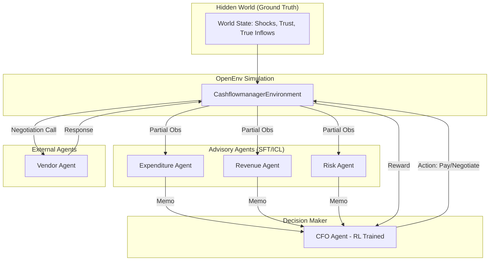

# Cashflow Multi-Agent RL Environment

A high-fidelity business simulation designed for multi-agent interaction, focused on CFO decision-making under partial observability and hidden world dynamics.

## 🏆 Hackathon Alignment
- **Theme #1: Multi-Agent Interactions**: Features Expenditure, Revenue, Risk, and Vendor agents.
- **Theme #3.1: World Modeling / Professional Tasks**: Models complex cash-flow workflows with real tools (negotiation, credit lines).
- **Outcome**: A realistic environment for training a "CFO LLM" to manage company finances.

## 🏗️ System Architecture



## 📂 Project Structure

- `models.py`: Data models for Invoices, Receivables, and Actions.
- `server/cashflowmanager_environment.py`: Core logic for `reset()`, `step()`, and `state()`.
- `server/data_generator.py`: Synthetic JSON generator for realistic financial scenarios.
- `server/agents.py`: System prompts and logic for advisory/vendor agents.
- `scripts/train_sft.py`: Training script for sub-agents using **Unsloth**.
- `scripts/train_rl.py`: RL training pipeline for the CFO using **HF TRL**.

## 🚀 Getting Started

### 1. Build the Environment
```bash
python3 -m server.app
```

### 2. Generate Synthetic Data
```bash
python3 server/data_generator.py
```

### 3. Training Pipeline
- **SFT (Sub-Agents)**: Use `scripts/train_sft.py` in Colab/Kaggle to train advisory agents on expert financial datasets.
- **RL (CFO Agent)**: Use `scripts/train_rl.py` to train the CFO decision-maker using rewards from bill settlement and liquidity preservation.

## 🤖 Agent Roles

| Agent | Focus | Input | Output |
| :--- | :--- | :--- | :--- |
| **Expenditure** | Liabilities | Invoices, Cash | Advice on payment priority |
| **Revenue** | Inflows | Receivables | Cash projection & risk warnings |
| **Risk** | Shocks | Credit, Hidden Events | Buffer recommendations |
| **Vendor** | External | Negotiation Requests | Accept/Reject/Counteroffer |
| **CFO** | Strategic | Advisor Memos, Stats | Final Action (Pay, Defer, Neg, etc.) |

## ⚖️ Reward Logic
- `+ Cash Balance`: Small reward for liquidity.
- `- Late Fees / Interest`: Heavy penalties for compounding debt.
- `+ Vendor Trust`: Rewards for consistent payments and successful negotiations.
- `+ Shock Absorption`: Rewards for surviving probabilistic cash shocks.
