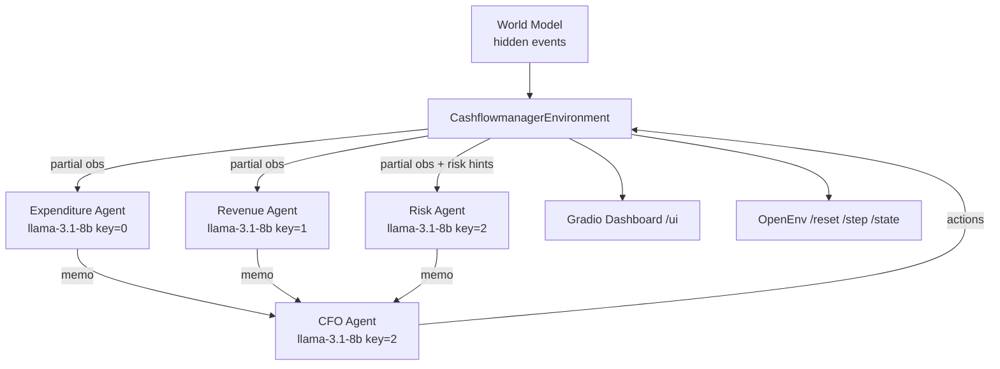

# Cashflow Multi-Agent RL Environment

A high-fidelity business simulation in which an AI agent plays the **CFO** of a company, deciding which invoices to pay, defer, negotiate, or settle on credit each day — under partial observability and a probabilistic world model that can throw cash shocks, payment delays, and audits at it without warning.

Built on top of **OpenEnv**, with a Gradio dashboard for inspection and a multi-agent advisory system (Expenditure / Revenue / Risk → CFO).

---

## Quick start

```bash
# 1. Install
pip install -r requirements.txt

# 2. Configure API keys (see "Environment variables" below)
cp .env.example .env  # then edit

# 3. Run the server (Gradio dashboard + OpenEnv HTTP endpoints)
python -m server.app
```

The dashboard is at <http://0.0.0.0:7860/ui>. OpenEnv endpoints (`/reset`, `/step`, `/state`) are mounted on the same FastAPI app.

---

## UI navigation
Gradio UI url - https://bhavishyasahay-cashflow-rl-management.hf.space/ui/

The dashboard has a sidebar (settings + actions) and three tabs in the main panel.

### Sidebar — Settings & Actions

- **Difficulty**: `easy` / `medium` / `hard`. Controls starting cash, invoice density, interest rates, and receivable reliability.
- **Seed**: `0` for a random scenario, or a fixed integer for reproducibility.
- **Preview Scenario** — peek at the initial state without running.
- **Run Full Simulation** — execute the entire `sim_window` end-to-end.
- **Start New / Next Day** — initialize a day-by-day run and step through it manually.
- **Theme toggle** (top-right `🌓`) — switches between dark and light mode. Buttons stay blue regardless.

### Tab 1 — Full Simulation

Runs every day in one shot. Two columns:

- **Left**: Simulation Summary table (final cash, credit used, invoices paid, late fees, etc.).
- **Right**: Day-by-Day Metrics chart, an Agent Score banner (with letter grade), and a per-dimension score breakdown.

### Tab 2 — Day-by-Day

Manually step through the simulation one day at a time.

- **Left**: Status table after the most recent day.
- **Right**: Running Metrics table that grows row-by-row. When the sim completes, the score banner + breakdown appear directly below it.

### Tab 3 — Logs

A scrollable log of every day, rendered as **cards** with rounded backgrounds and a blue accent border. Each card contains:

- Opening cash / credit balance and invoice counts.
- World events triggered that day (cash shocks, payment delays, etc.).
- Each advisor's memo, formatted as a blockquote.
- The CFO's action plan, one line per invoice with an icon for the action type.
- Closing balances, reward, late fees, and interest.

Page-level scrolling is locked — only the logs container scrolls internally, so the sidebar and tab headers stay visible.

---

## Simulation logic

A simulation is a sequence of `sim_window` business days (default `3`). Each day follows the same fixed cycle:

```
Day N:
  1. Activate any incoming invoices scheduled to appear today
  2. Age all unpaid invoices (decrement due_in; mark overdue if past 0)
  3. Collect receivables expected today (probability roll per receivable)
  4. Decide actions:
       (a) Fast path — rule-based, no LLM
       (b) Full path — three advisors in parallel + CFO sequentially
  5. Apply CFO actions (pay / partial / credit / defer)
  6. Charge daily interest on remaining balances
  7. Trigger world events for the day (shocks, delays, fraud, revenue miss)
  8. Compute reward via CashflowRubric → write DayLog
```

### State the CFO sees

| Component | Description |
|---|---|
| **Cash** | Current balance. Can go negative up to `-credit_limit` before bankruptcy. |
| **Active Invoices** | Vendor bills with `amount`, `due_in`, `late_fee`, `interest`, `status`. |
| **Receivables** | Expected customer payments with `expected_in` day and arrival `probability`. |
| **Credit** | A fixed credit line. Drawing on it boosts cash now but hurts the final score. |
| **Vendor Profiles** | `trust_score` and `negotiation_flexibility`, used by the `negotiate` action. |
| **Advisor Memos** | Structured notes from Expenditure / Revenue / Risk agents. |
| **World Events** | Hidden, probabilistic shocks. The CFO doesn't see them in advance — only the Risk agent gets vague hints (`market_stress`, `upcoming_risk_level`). |

### World model — hidden dynamics

A `WorldModel` instance is initialized per scenario and generates a private timeline of events:

- **Cash shocks** — equipment failure, tax audits, regulatory fines, supplier hikes (8–25% of starting cash each).
- **Payment delays** — receivables get pushed out by 1–3 days.
- **Revenue miss** — raises market stress for subsequent days.
- **Fraud anomalies** — rare, scaled-down cash deductions.

Events fire *after* CFO actions each day (the agent decides without seeing tomorrow's shock). The Risk Agent receives partial hints via `world_model.get_risk_hints(day)` so it can warn the CFO of elevated stress without revealing exact amounts.

### Dynamic data generation

Every scenario is fresh — no fixed test set. The generator:

1. Samples vendors, invoices, receivables, and incoming-invoice timelines based on difficulty.
2. Runs a **solvability check** to guarantee the agent has a feasible path to break-even, then applies a difficulty-specific buffer.
3. Hands the scenario to the env, which wraps it in a `CashflowmanagerObservation` and a `WorldModel`.

| Difficulty | Cash | Credit | Invoices | Receivables |
|---|---|---|---|---|
| `easy` | ₹40k–50k | ₹20k | 3–4 | 3–4 (85–95% prob) |
| `medium` | ₹25k–35k | ₹10k | 4–6 | 2–3 (70–85% prob) |
| `hard` | ₹2k–5k | ₹2k | 6–8 | 2–3 (60–80% prob) |

---

## Multi-agent architecture



The three advisors run **in parallel** via `ThreadPoolExecutor(max_workers=3)`. The CFO runs sequentially after all three memos arrive, on the Risk agent's key (since Risk has the smallest prompt → most leftover TPM headroom).

### Agent roles

| Agent | Reads | Outputs |
|---|---|---|
| **Expenditure** | Active invoices, cash | Payment priority list, critical-invoice flags, recommended action |
| **Revenue** | Receivables, expected timing | Total expected inflow, reliable vs at-risk receivables, 3-day cash projection |
| **Risk** | Debt-to-cash ratio, credit util, market stress hints | Risk level (low/moderate/elevated/critical), recommended cash buffer, threats |
| **CFO** | Full state, history, advisor memos, invoice list | One action per invoice with a confidence score |

---

## Reward & scoring

Two distinct concepts:

### Per-step reward — OpenEnv `Rubric` pattern

`CashflowRubric` plugs into `Environment.rubric` and composes independently-weighted sub-rubrics rather than collapsing reward into a single scalar:

- on-time payment bonus
- late-fee / interest penalty
- credit-draw penalty
- cash-buffer health

This avoids the monolithic-reward trap where one number accidentally rewards the wrong behavior (e.g. an agent that hoards cash to dodge fees but never pays anyone). With independent components, you can see which signal is dominating and tune weights surgically.

### End-of-simulation score — five dimensions

| Dimension | Weight | Question |
|---|---|---|
| Solvency | 25% | Did the company survive without going deeply negative? |
| Debt Clearance | 30% | What fraction of invoices were fully paid? |
| Fiscal Discipline | 20% | Were late fees + interest avoided? |
| Credit Prudence | 10% | Was the credit line used sparingly? |
| Cash Management | 15% | Did the agent end with more cash than it started? |

Final score in `[0, 1]` plus a letter grade (A ≥ 0.90, B ≥ 0.75, C ≥ 0.55, D ≥ 0.35, F otherwise).

---

## OpenEnv integration

The FastAPI app is built via OpenEnv's `create_app(...)` factory:

```python
from openenv.core.env_server.http_server import create_app
from server.cashflowmanager_environment import (
    CashflowmanagerEnvironment,
    CashflowmanagerAction,
    CashflowmanagerObservation,
)

app = create_app(
    CashflowmanagerEnvironment,
    CashflowmanagerAction,
    CashflowmanagerObservation,
    env_name="cashflowmanager",
    max_concurrent_envs=1,
)
```

This automatically wires `/reset`, `/step`, and `/state` HTTP endpoints. The Gradio dashboard mounts on top via `gr.mount_gradio_app(app, ..., path="/ui")`.

A remote client can drive the env via `server/client.py`, which extends `openenv.core.EnvClient`.

---

## Performance optimizations

The ICL flow makes 4 LLM calls per complex day. Without optimization, that easily blows past Groq's free-tier rate limits. The following changes brought a 3-day hard-difficulty sim down to ~10s with zero rate-limit failures.

### 1. Rule-based fast path

`_try_fast_path()` short-circuits the LLM entirely on trivial days (no overdue invoices, ≤3 unpaid bills, enough cash to cover all). On easy / medium difficulty, this skips 30–50% of LLM calls.

### 2. Slim prompts

Advisor prompts no longer include `serialize_history(past_logs)` (only the CFO does). Each advisor receives a minimal one-line state header plus its own data slice. Prompt size dropped ~55% per call, eliminating `json_validate_failed` truncation errors.

### 3. Parallel advisors

The three advisors run concurrently via `ThreadPoolExecutor(max_workers=3)`. Per-day wall-clock dropped from ~12s (sequential) to ~4s.

### 4. Multi-account API keys

Groq's free tier rate-limits at the **organization** level (~6,000 TPM for `llama-3.1-8b-instant`). Multiple keys from the same account share one bucket — they don't multiply capacity.

The fix: three keys from **three separate Groq accounts**, with per-agent key isolation (Expenditure → key 0, Revenue → key 1, Risk → key 2, CFO → reuses key 2). Triples the effective TPM ceiling.

---

## Environment variables

Set these in `.env` (or pass at the shell):

```bash
# API key (single-key mode — fallback)
GROQ_API_KEY=gsk_...

# Multi-key pool (recommended). Comma-separated, no quotes around individual keys.
# These MUST be from 3 separate Groq accounts to actually multiply TPM.
GROQ_API_KEYS=gsk_key1,gsk_key2,gsk_key3

# Models
MODEL_NAME=llama-3.1-8b-instant
CFO_MODEL_NAME=llama-3.1-8b-instant
ADVISOR_MODEL_NAME=llama-3.1-8b-instant
EXPENDITURE_MODEL_NAME=llama-3.1-8b-instant
REVENUE_MODEL_NAME=llama-3.1-8b-instant
RISK_MODEL_NAME=llama-3.1-8b-instant

# Per-agent key indices (override if you have a different mapping)
EXPENDITURE_KEY_INDEX=0
REVENUE_KEY_INDEX=1
RISK_KEY_INDEX=2
CFO_KEY_INDEX=2

# Confidence gate threshold (currently informational)
CFO_CONFIDENCE_THRESHOLD=0.85

# Retry / timeout knobs
LLM_MAX_RETRIES=5
LLM_TIMEOUT_SECONDS=20

# Set to "true" to load a local Hugging Face model instead of hitting Groq
USE_LOCAL_HF=false
LOCAL_MODEL_PATH=unsloth/Llama-3.2-1B-Instruct
```

---

## Project structure

```
cashflow manager/
├── server/
│   ├── app.py                       # FastAPI + Gradio dashboard, mounts on /ui
│   ├── cashflowmanager_environment.py  # CashflowmanagerEnvironment class + sim loop
│   ├── agents.py                    # Advisor + CFO prompts, per-agent key indices
│   ├── client.py                    # Groq/OpenAI client wrapper, multi-key parsing
│   ├── data_generator.py            # Dynamic scenario generation
│   ├── world_model.py               # Hidden event timeline + risk hints
│   ├── reward.py                    # CashflowRubric (OpenEnv Rubric pattern)
│   ├── scoring.py                   # End-of-sim five-dimension score
│   ├── state_serializer.py          # Prompt-friendly state / history formatters
│   └── tasks.py
├── models.py                        # Pydantic models (Action, Observation, Invoice, ...)
├── inference.py                     # Single-episode CLI runner that writes transitions.jsonl
├── client.py                        # OpenEnv EnvClient subclass for remote use
├── scripts/
│   ├── train_sft.py                 # SFT training (Unsloth)
│   ├── train_rl.py                  # RL training (HF TRL)
│   ├── generate_sft_data.py         # Expert demonstration data
│   └── generate_rl_transitions.py   # RL transition generator
├── data/                            # Generated SFT datasets (gitignored)
├── images_blog/                     # Diagrams used by the blog post
└── .env                             # API keys + model config (gitignored)
```

---

## Training pipeline (offline)

The runtime app uses ICL only. Training scripts live in `scripts/` and are run separately (typically in Colab / Kaggle for the GPU access):

- **SFT** — `scripts/train_sft.py` fine-tunes per-agent SFT models on `data/{agent}_sft.jsonl`. Uses Unsloth for 4-bit quantization.
- **RL** — `scripts/train_rl.py` runs PPO on top of the SFT-tuned CFO using `transitions.jsonl` from `inference.py`.

Set `USE_LOCAL_HF=true` and `LOCAL_MODEL_PATH=...` to point the runtime at a fine-tuned model instead of Groq.

---


## HF space url - https://huggingface.co/spaces/bhavishyasahay/cashflow-RL-management
